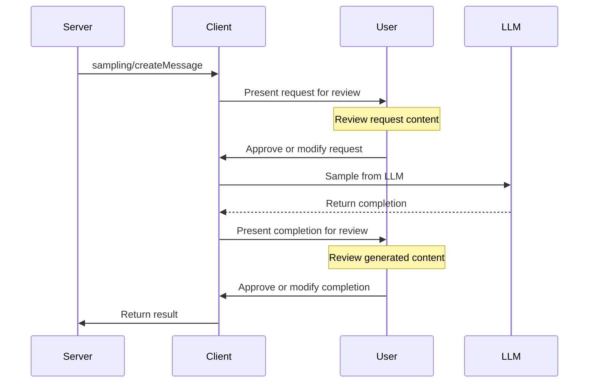

## How is MCP Scripted?


Since the original server implementation is in python, and a majority of what we use at the agent layer is also written in python, we will use the Python SDK for MCP for scripting references. 

but before we dive into the codebase, lets review the key concepts with desicriptions from the documentation: 

## How is MCP Scripted? 

To get a real sense of how cle


* [_Clients_], like Claude Desktop or Cursor,  

```python
from mcp import ClientSession, StdioServerParameters, types
from mcp.client.stdio import stdio_client

# Create server parameters for stdio connection
server_params = StdioServerParameters(
    command="python",  # Executable
    args=["example_server.py"],  # Optional command line arguments
    env=None,  # Optional environment variables
)


# Optional: create a sampling callback
async def handle_sampling_message(
    message: types.CreateMessageRequestParams,
) -> types.CreateMessageResult:
    return types.CreateMessageResult(
        role="assistant",
        content=types.TextContent(
            type="text",
            text="Hello, world! from model",
        ),
        model="gpt-3.5-turbo",
        stopReason="endTurn",
    )


async def run():
    async with stdio_client(server_params) as (read, write):
        async with ClientSession(
            read, write, sampling_callback=handle_sampling_message
        ) as session:
            # Initialize the connection
            await session.initialize()

            # List available prompts
            prompts = await session.list_prompts()

            # Get a prompt
            prompt = await session.get_prompt(
                "example-prompt", arguments={"arg1": "value"}
            )

            # List available resources
            resources = await session.list_resources()

            # List available tools
            tools = await session.list_tools()

            # Read a resource
            content, mime_type = await session.read_resource("file://some/path")

            # Call a tool
            result = await session.call_tool("tool-name", arguments={"arg1": "value"})


if __name__ == "__main__":
    import asyncio

    asyncio.run(run())
```

* [_Servers_] form the core interface to the MCP protocol. It handles connection management, protocol compliance, and message routing. All python-based mcp _Servers_ implement a pattern similar to: 

```python 
# Add lifespan support for startup/shutdown with strong typing
from contextlib import asynccontextmanager
from collections.abc import AsyncIterator
from dataclasses import dataclass

from fake_database import Database  # Replace with your actual DB type

from mcp.server.fastmcp import Context, FastMCP

# Create a named server
mcp = FastMCP("My App")

# Specify dependencies for deployment and development
mcp = FastMCP("My App", dependencies=["pandas", "numpy"])


@dataclass
class AppContext:
    db: Database


@asynccontextmanager
async def app_lifespan(server: FastMCP) -> AsyncIterator[AppContext]:
    """Manage application lifecycle with type-safe context"""
    # Initialize on startup
    db = await Database.connect()
    try:
        yield AppContext(db=db)
    finally:
        # Cleanup on shutdown
        await db.disconnect()


# Pass lifespan to server
mcp = FastMCP("My App", lifespan=app_lifespan)


# Access type-safe lifespan context in tools
@mcp.tool()
def query_db(ctx: Context) -> str:
    """Tool that uses initialized resources"""
    db = ctx.request_context.lifespan_context["db"]
    return db.query()
```

* [Prompts](https://modelcontextprotocol.io/docs/concepts/prompts) help abstract complex LLM interaction workflows into resuable interaction templates.

```python
from mcp.server.fastmcp import FastMCP
from mcp.server.fastmcp.prompts import base

mcp = FastMCP("My App")

@mcp.prompt()
def debug_error(error: str) -> list[base.Message]:
    return [
        base.UserMessage("I'm seeing this error:"),
        base.UserMessage(error),
        base.AssistantMessage("I'll help debug that. What have you tried so far?"),
    ]
```

* [Tools](https://modelcontextprotocol.io/docs/concepts/tools) enable LLMs to perform actions on servers. They are designed to be model-controlled, meaning that tools are exposed from servers to clients with the intention of the AI model being able to automatically invoke them (with a human in the loop to grant approval). Unlike resources, tools are expected to perform computation and have side effects:

```python
import httpx
from mcp.server.fastmcp import FastMCP

mcp = FastMCP("My App")

@mcp.tool()
async def fetch_weather(city: str) -> str:
    """Fetch current weather for a city"""
    async with httpx.AsyncClient() as client:
        response = await client.get(f"https://api.weather.com/{city}")
        return response.text
```

* [_Resources_](https://modelcontextprotocol.io/docs/concepts/_Resources_) allow servers to expose data and content that can be read by clients and used as context for LLM interactions. They are designed to be application-controlled, meaning that the client application can decide how and when they should be used. 

```python
from mcp.server.fastmcp import FastMCP

mcp = FastMCP("My App")

@mcp.resource("users://{user_id}/profile")
def get_user_profile(user_id: str) -> str:
    """Dynamic user data"""
    return f"Profile data for user {user_id}"
```


* [_Sampling_](https://modelcontextprotocol.io/docs/concepts/sampling) enables the MCP _servers_ to request completions from LLMs. MCP's _Sampling_ request schema includes a couple neat features like model selection and context, but technically MCP doesn't actually interface directly with the LLM. is the mechanism by which MCP allows servers to request LLM completions through the client, enabling sophisticated agentic behaviors. In other words, it enables the LLM to say... "let me do my job", and provides a human-in-the-loop approval check in the process.



[Roots](https://modelcontextprotocol.io/docs/concepts/roots) define the boundaries where servers can operate. They provide a way for clients to inform servers about relevant _Resources_ and their locations. A root is a URI that a client suggests a server should focus on. When a client connects to a server, it declares which roots the server should work with. While primarily used for filesystem paths, roots can be any valid URI including HTTP URLs.

[Transports](https://modelcontextprotocol.io/docs/concepts/transports)


 

 without an implementation on the client side, your mcp will lack the basic features needed to support _Sampling_. 

Turns out the llm client ends up implementing tool calling (as it always has), which means _how_ an llm actually chooses tools is up to the developer. In MCP, [_clients_](https://modelcontextprotocol.io/clients) actually implement the logic, so innovation is limited by what the _client_ supports. See MCP's [example client](https://modelcontextprotocol.io/quickstart/client) for their reference implementation. 

What about server side?


